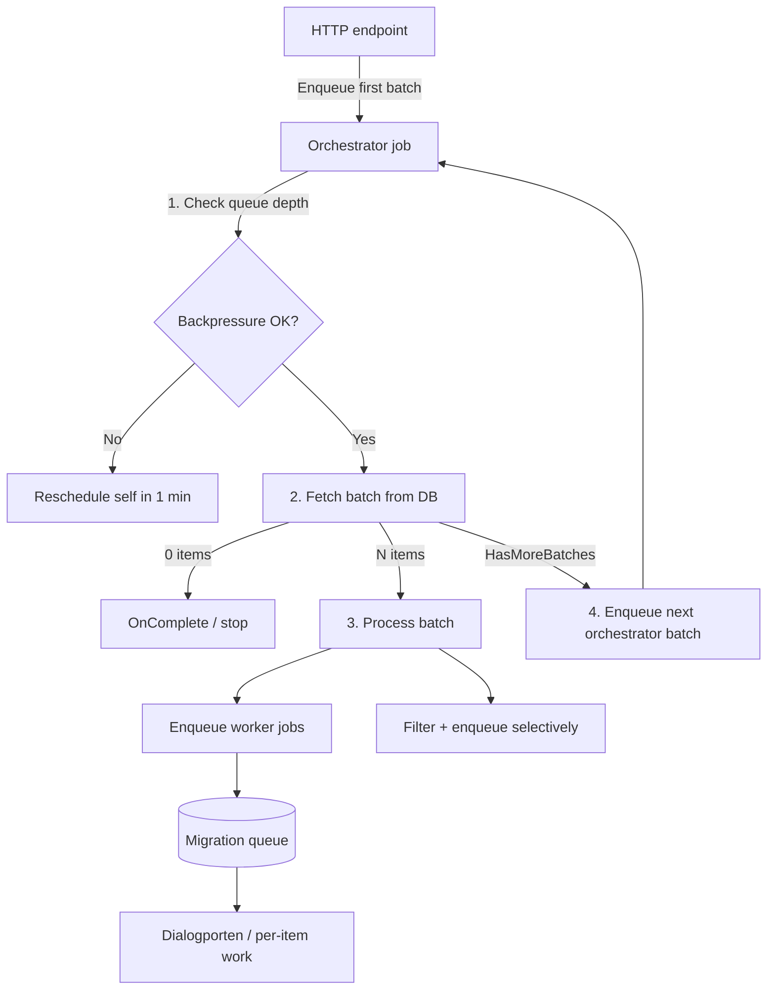

# Chained Batch Jobs

A small framework for reliably iterating over large datasets and applying updates through Hangfire.

Use this when you need to:

- Walk the entire database (or a date range) deterministically
- Fan out per-entity work to a high-throughput worker queue
- Survive queue backpressure without losing cursor position
- Avoid re-implementing the same orchestration loop for every Dialogporten backfill

This framework covers the **chained orchestrator + fan-out** pattern. It does not replace in-process `while` loops used by some cleanup jobs.

## Architecture

Each batch job is split into two layers:

| Layer | Location | Responsibility |
|-------|----------|----------------|
| **Framework** | `Application/BatchJobs/` | Shared orchestration loop |
| **Job definition** | `Application/{Feature}/{Feature}BatchJob.cs` | Fetch query, worker enqueue, state/cursor wiring |
| **Handler** | `Application/{Feature}/{Feature}Handler.cs` | HTTP entry point + Hangfire method that calls the orchestrator |



Hangfire queues (defined in `Integrations/Hangfire/HangfireQueues.cs`):

| Queue | Typical use |
|-------|-------------|
| `default` | Normal correspondence lifecycle jobs |
| `live-migration` | Migration orchestrators (lightweight, chains quickly) |
| `migration` | Heavy per-entity workers (Dialogporten API calls) |

The migration server processes `live-migration` before `migration`.

## Orchestrator loop

`ChainedBatchJobOrchestrator.RunBatchAsync` executes one batch per Hangfire invocation:

1. **Backpressure check** — if the monitored queue exceeds the limit, reschedule the same state and return
2. **Fetch** — query the next window of entities using a keyset cursor. On command timeout (`TimeoutException` or `OperationCanceledException` from the database, not from job cancellation), report `FetchFailed` and reschedule with the **same** cursor
3. **Stop on empty** — call `OnComplete` and return (never call `.Last()` on an empty list)
4. **Process** — either fan out workers (`EnqueueWorkerJob`) or run custom batch logic (`ProcessBatchAsync`)
5. **Chain** — if `HasMoreBatches` is true, enqueue the next orchestrator job with an advanced cursor

Each orchestrator job is short-lived. Progress is carried forward in the job state (cursor + counters), not in memory.

## Core types

### `KeysetCursor`

```csharp
public record KeysetCursor(DateTimeOffset Created, Guid Id);
```

A composite cursor for stable pagination. **Always use both `Created` and `Id`** — filtering on `Created` alone will skip rows that share the same timestamp.

### `ChainedBatchJobFetchResult<TItem>`

```csharp
public record ChainedBatchJobFetchResult<TItem>(IReadOnlyList<TItem> Items, bool HasMoreBatches);
```

Returned by `FetchBatchAsync`. `HasMoreBatches` controls whether the orchestrator chains another batch.

### `ChainedBatchJobSettings`

| Property | Description |
|----------|-------------|
| `JobName` | Used in log messages |
| `BatchSize` | Nominal batch size (also used as the full-batch signal in simple fetch patterns) |
| `WorkerQueue` | Queue for per-entity worker jobs (default: `migration`) |
| `OrchestratorQueue` | Queue for orchestrator jobs (default: `live-migration`) |
| `BackpressureMonitorQueue` | Queue whose depth is checked before fetching (default: `migration`) |
| `BackpressureLimit` | Max enqueued jobs before rescheduling |
| `BackpressureRescheduleDelay` | Delay before retrying (default: 1 minute) |

Use `ChainedBatchJobQueues.Orchestrator` and `ChainedBatchJobQueues.Worker` in enqueue delegates so orchestrator and worker jobs always land on the correct queues.

Use `ResolveBackpressureLimit` on the definition when the limit depends on request state (e.g. `windowSize * 2`).

### `ChainedBatchJobDefinition<TState, TItem>`

| Member | Required | Description |
|--------|----------|-------------|
| `Settings` | Yes | Job configuration |
| `FetchBatchAsync` | Yes | Query the next batch; return items + `HasMoreBatches` |
| `GetCursorFromItem` | Yes | Extract `(Created, Id)` from the last item in a batch |
| `CreateNextState` | Yes | Build the next orchestrator state from cursor + accumulated state |
| `EnqueueNextBatch` | Yes | Enqueue the next orchestrator Hangfire job |
| `RescheduleBatch` | Yes | Reschedule the current state when backpressure triggers |
| `EnqueueWorkerJob` | One of two | Sync fan-out: enqueue one Hangfire job per item |
| `ProcessBatchAsync` | One of two | Async batch logic: filter, count, selectively enqueue workers |
| `OnComplete` | No | Called when the job finishes (empty fetch or final batch) |
| `ResolveBackpressureLimit` | No | Override `Settings.BackpressureLimit` per state |
| `BuildProgressMetrics` | No | Job-specific counters/filters included in status polling and logs |

Exactly one of `EnqueueWorkerJob` or `ProcessBatchAsync` must be defined.

## Progress reporting and polling

Every orchestrator batch automatically reports status through `ChainedBatchJobProgressReporter`:

- **Structured logs** — search for `ChainedBatchJobStatus` in application logs. Each batch writes cursor position, phase, queue depth, and metrics.
- **Pollable cache** — the latest snapshot per job is stored in hybrid cache (90-day TTL, refreshed each batch).

### Polling via API

```http
GET /correspondence/api/v1/maintenance/batch-jobs/status
GET /correspondence/api/v1/maintenance/batch-jobs/status/{jobName}
```

`jobName` matches `ChainedBatchJobSettings.JobName` (e.g. `MakeCorrespondenceAvailable`, `UpdateOldCorrespondencesWithDownloadAll`).

Example response:

```json
{
  "jobName": "UpdateOldCorrespondencesWithDownloadAll",
  "phase": "Running",
  "updatedAt": "2026-06-23T14:30:00Z",
  "cursorCreated": "2024-03-15T08:12:33Z",
  "cursorId": "a1b2c3d4-...",
  "lastBatchItemCount": 10000,
  "hasMoreBatches": true,
  "workerQueueDepth": 15234,
  "backpressureLimit": 20000,
  "metrics": {
    "windowSize": 10000,
    "totalProcessed": 250000,
    "totalPatched": 12000
  }
}
```

`phase` is one of:

| Phase | Meaning |
|-------|---------|
| `Running` | Batch processed; more data remains |
| `WaitingForBackpressure` | Worker queue full; orchestrator rescheduled |
| `FetchFailed` | Database fetch timed out; orchestrator rescheduled with same cursor |
| `Completed` | No more items (or final batch finished) |

### Opt-in cursor and metrics

Implement `IChainedBatchJobCursorState` on the job state type for automatic cursor reporting when no batch has been fetched yet (e.g. during backpressure waits).

Add `BuildProgressMetrics` on the definition for job-specific counters:

```csharp
BuildProgressMetrics = request => new Dictionary<string, object?>
{
    ["totalProcessed"] = request.TotalProcessed,
},
```

## Processing modes

### Mode A: Simple fan-out

Use when every fetched item should become a worker job with no orchestrator-side filtering.

**Reference:** `MigrateCorrespondence/MakeCorrespondenceAvailableBatchJob.cs`

```csharp
FetchBatchAsync = async (request, ct) =>
{
    var items = await repository.GetCandidates(...);
    return new ChainedBatchJobFetchResult<CorrespondenceEntity>(items, items.Count == BatchSize);
},
EnqueueWorkerJob = (item, request) =>
    backgroundJobClient.Enqueue<MyHandler>(
        ChainedBatchJobQueues.Worker,
        h => h.ProcessItem(item.Id, CancellationToken.None)),
```

Orchestrator on `live-migration`, workers on `migration`.

### Mode B: Filtered fan-out with counters

Use when the orchestrator must inspect each item (e.g. load related data) before deciding whether to enqueue a worker.

**Reference:** `UpdateOldCorrespondencesWithDownloadAll/UpdateOldCorrespondencesWithDownloadAllBatchJob.cs`

```csharp
ProcessBatchAsync = async (request, items, ct) =>
{
    foreach (var item in items)
    {
        if (MeetsCriteria(item))
            backgroundJobClient.Enqueue<IDialogportenService>(...);
    }
    return request with { TotalProcessed = request.TotalProcessed + items.Count };
},
OnComplete = request => logger.LogInformation("Done. Processed {Total}", request.TotalProcessed),
```

`ProcessBatchAsync` runs **before** the next batch is chained. Return updated state so `CreateNextState` can carry counters forward.

## Pagination patterns

### Full-batch signal

Fetch exactly `BatchSize` items. If the result count equals `BatchSize`, assume more data may exist:

```csharp
return new ChainedBatchJobFetchResult<T>(items, items.Count == BatchSize);
```

Works well when an extra empty orchestrator invocation at the end is acceptable (it stops cleanly on zero results).

### Probe fetch (`N + 1`)

Fetch `windowSize + 1` items. If more than `windowSize` are returned, trim the extra probe row and set `HasMoreBatches = true`:

```csharp
var window = await repository.GetWindowAfter(windowSize + 1, cursor...);
var hasMore = window.Count > windowSize;
if (hasMore) window.RemoveAt(window.Count - 1);
return new ChainedBatchJobFetchResult<T>(window, hasMore);
```

Use this when you need to detect end-of-data precisely without an extra orchestrator round-trip. Required when the total row count is an exact multiple of `windowSize`.

### Keyset cursor in repository queries

Repository methods must use **both** cursor fields. Examples in `CorrespondenceRepository`:

**Descending** (`OrderByDescending Created, ThenBy Id`):

```csharp
c.Created < cursorCreated ||
(c.Created == cursorCreated && c.Id > cursorId)
```

**Ascending** (`OrderBy Created, ThenBy Id`):

```csharp
c.Created > lastCreated ||
(c.Created == lastCreated && c.Id > lastId)
```

## Creating a new batch job

### 1. Add a state/request type

Carry cursor position and any job-specific options:

```csharp
public class MyBatchJobRequest
{
    public DateTimeOffset? CursorCreated { get; set; }
    public Guid? CursorId { get; set; }
    public int BatchSize { get; set; } = 1000;
    // job-specific fields...
}
```

### 2. Add `{Feature}BatchJob.cs`

```csharp
public class MyBatchJob(
    IMyRepository repository,
    IBackgroundJobClient backgroundJobClient)
{
    public ChainedBatchJobDefinition<MyBatchJobRequest, MyEntity> CreateDefinition() => new()
    {
        Settings = new ChainedBatchJobSettings
        {
            JobName = "MyBatchJob",
            BatchSize = 1000,
            BackpressureLimit = 1000 * 20,
        },
        FetchBatchAsync = async (request, ct) => { ... },
        GetCursorFromItem = item => new KeysetCursor(item.Created, item.Id),
        EnqueueWorkerJob = (item, request) => backgroundJobClient.Enqueue<...>(...),
        CreateNextState = (request, cursor, count) => new MyBatchJobRequest
        {
            CursorCreated = cursor.Created,
            CursorId = cursor.Id,
            // preserve other fields...
        },
        EnqueueNextBatch = nextState =>
            backgroundJobClient.Enqueue<MyHandler>(
                ChainedBatchJobQueues.Orchestrator,
                h => h.ExecuteBatch(nextState, CancellationToken.None)),
        RescheduleBatch = state =>
            backgroundJobClient.Schedule<MyHandler>(
                ChainedBatchJobQueues.Orchestrator,
                h => h.ExecuteBatch(state, CancellationToken.None),
                TimeSpan.FromMinutes(1)),
    };
}
```

### 3. Wire up the handler

```csharp
public class MyHandler(
    IBackgroundJobClient backgroundJobClient,
    ChainedBatchJobOrchestrator orchestrator,
    MyBatchJob batchJob,
    ILogger<MyHandler> logger)
    : IHandler<MyBatchJobRequest, MyBatchJobResponse>
{
    public Task<OneOf<MyBatchJobResponse, Error>> Process(MyBatchJobRequest request, ...)
    {
        var jobId = backgroundJobClient.Enqueue<MyHandler>(
            ChainedBatchJobQueues.Orchestrator,
            h => h.ExecuteBatch(request, CancellationToken.None));
        return Task.FromResult(...);
    }

    [AutomaticRetry(Attempts = 0)]
    public async Task ExecuteBatch(MyBatchJobRequest request, CancellationToken cancellationToken)
    {
        await orchestrator.RunBatchAsync(request, batchJob.CreateDefinition(), cancellationToken);
    }

    [AutomaticRetry(Attempts = 0)]
    public async Task ProcessItem(Guid entityId, CancellationToken cancellationToken)
    {
        // per-entity Dialogporten call
    }
}
```

### 4. Register in DI

In `Application/DependencyInjection.cs`:

```csharp
services.AddScoped<ChainedBatchJobOrchestrator>();
services.AddScoped<MyBatchJob>();
services.AddScoped<MyHandler>();
```

`ChainedBatchJobOrchestrator` is a singleton-scoped service (registered as scoped, like all handlers). Only one registration is needed for the whole application.

### 5. Add an API endpoint

- **Data migration / backfill** → `MigrationController`
- **Operational maintenance / repair** → `MaintenanceController`

## Reference implementations

| Job | Batch job class | Mode | Orchestrator queue | Worker queue |
|-----|-----------------|------|--------------------|--------------|
| Make migrated correspondence available in Dialogporten | `MakeCorrespondenceAvailableBatchJob` | Simple fan-out | `live-migration` | `migration` |
| Add download-all to old correspondences | `UpdateOldCorrespondencesWithDownloadAllBatchJob` | Filtered fan-out | `live-migration` | `migration` |

## Conventions and pitfalls

**Hangfire method signatures.** Enqueued methods must be public on a DI-registered class. Use `CancellationToken.None` in enqueue expressions; pass the real token only in synchronous HTTP paths.

**`[AutomaticRetry(Attempts = 0)]`.** Batch orchestrators should not auto-retry — a retry would re-fetch and re-enqueue the same batch, causing duplicate worker jobs. Handle errors explicitly in `ProcessBatchAsync` or worker methods.

**Idempotent workers.** Workers may run more than once (Hangfire retries, manual re-triggers). Design per-entity work to be safe to repeat (e.g. check for existing Dialogporten reference before creating).

**State is the checkpoint.** The cursor and counters live in the Hangfire job argument. Do not store cursor position only in logs or external state.

**Never paginate on offset.** Use keyset (`Created`, `Id`) cursors. Offset pagination degrades and misses rows under concurrent writes.

**Composite cursor is mandatory.** If multiple entities share the same `Created` timestamp, an `Id`-only or `Created`-only cursor will skip or repeat rows.

**Backpressure reschedules preserve state.** When the queue is full, the orchestrator reschedules itself with the **same** state (same cursor). No progress is lost.

**Choose the right queue for orchestrators.** Use `ChainedBatchJobQueues.Orchestrator` (`live-migration`) for orchestrator enqueue/reschedule and `ChainedBatchJobQueues.Worker` (`migration`) for per-entity Dialogporten work. Keep orchestrator jobs lightweight (DB query + enqueue). Heavy Dialogporten calls belong on worker jobs in the `migration` queue.

## What this framework does not cover

- **In-process `while` loops** — used by cleanup jobs (`CleanupOrphanedDialogs`, etc.) that run a single long Hangfire job. These risk invisibility timeout on very large datasets.
- **Chained jobs without fan-out** — e.g. `SmsNotificationLengthStatisticsHandler` accumulates stats inline. Could adopt `ProcessBatchAsync` without worker enqueue, but is not migrated yet.
- **Repository query design** — cursor queries live in `Core/Repositories` + `Persistence/Repositories`. The framework assumes they are correct.
